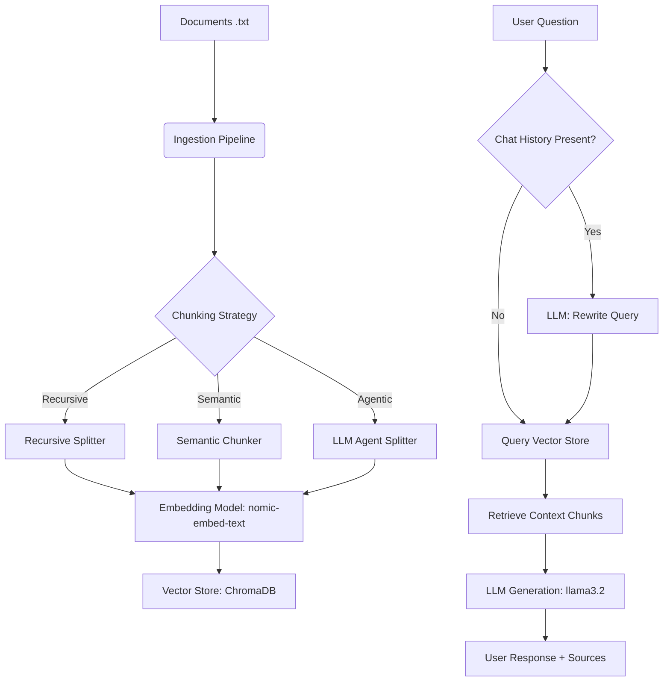

# AuraRAG Studio - Premium Local RAG Chatbot

AuraRAG Studio is an advanced, local-first **Retrieval-Augmented Generation (RAG)** studio. It features a modern, glassmorphic React frontend dashboard and a robust FastAPI backend. The application processes local files, performs smart document chunking (Recursive, Character, Semantic, and LLM-driven Agentic), indexes them into a Chroma vector store, and provides a context-aware chat interface utilizing local LLMs.

---

## 🚀 Key Features

*   **Glassmorphic UI / Chat Studio**: A premium, responsive dark-themed workspace with real-time logs, message histories, and source document/score inspection.
*   **Diverse Ingestion Pipelines**:
    *   *Character Splitter*: Standard delimiter-based splitting.
    *   *Recursive Character Splitter*: Multi-level splitting (paragraphs, sentences) to maintain semantic context.
    *   *Semantic Chunker*: Dynamically splits text based on sentence embedding distance shifts.
    *   *Agentic Chunker*: Uses LLM prompts to split documents at logical topic boundaries.
*   **Interactive Terminal Console**: Shows live backend ingestion output directly inside the UI.
*   **Smart Search & Retrieval**: Supports standard *Similarity Search*, *Maximal Marginal Relevance (MMR)* (for diversity), and *Similarity Score Threshold* filtering.
*   **Context-Aware Chat**: Rewrites follow-up questions into standalone search queries using past conversation history to maintain context.
*   **Local-First & Secure**: Built using local embeddings (`nomic-embed-text`) and LLMs (`llama3.2`) served via Ollama. Optional support for OpenAI models.

---

## 🏛️ System Architecture (Interview Prep Cheat Sheet)

Use this guide to master the technical details and trade-offs of this RAG design for system design or technical interviews.



### Essential Interview FAQs

#### 1. How did you handle SQLite file locking in a multi-threaded FastAPI application?
*   **Challenge**: The frontend periodically polls `/api/db/stats` to display chunk counts, maintaining open read connections to `chroma.sqlite3`. When starting a new ingestion, calling `shutil.rmtree(DB_DIR)` to delete the folder unlinked database files underneath active file handles, causing SQLite to throw `(code: 1032) attempt to write a readonly database`.
*   **Solution**: Instead of unlinking directory files, we connect to the active Chroma instance and clear the collection rows transactionally using `db.delete(ids=db.get()['ids'])`. This maintains valid file handles across concurrent API threads.

#### 2. What is the difference between Semantic and Agentic chunking?
*   **Semantic Chunking**: Analyzes sentence-to-sentence distance using text embeddings. When the cosine distance between consecutive sentences exceeds a statistical threshold (e.g., 95th percentile), it identifies a topic shift and creates a boundary.
*   **Agentic Chunking**: Treats document segmentation as a cognitive task. An LLM reviews text segments and inserts explicit split tokens (`<<<SPLIT>>>`) where it identifies logical topic changes, ensuring high coherence.

#### 3. How does the history-aware query rewriter work?
*   If a conversation has history (e.g., User: *"Who is Nvidia's CEO?"* Assistant: *"Jensen Huang."* User: *"When did he join?"*), sending the second question alone to the database yields poor search results because `"he"` is ambiguous.
*   The query rewriter passes the history and the question to the LLM with a system instruction to output a standalone search query: *"When did Jensen Huang join Nvidia?"*, which is then embedded and queried against the vector store.

---

## 🛠️ Installation & Setup

### Prerequisites
*   Python 3.10+
*   Node.js 18+
*   [Ollama](https://ollama.com/) (installed and running)

### Model Setup (Ollama)
```bash
# Pull embedding model
ollama pull nomic-embed-text

# Pull LLM
ollama pull llama3.2
```

### Backend Setup
1.  Navigate to the backend folder:
    ```bash
    cd backend
    ```
2.  Create and activate virtual environment:
    ```bash
    python -m venv venv
    source venv/bin/activate  # On Windows: venv\Scripts\activate
    ```
3.  Install dependencies:
    ```bash
    pip install -r requirements.txt
    ```
4.  Run the API server:
    ```bash
    python server.py
    ```

### Frontend Setup
1.  Navigate to the frontend folder:
    ```bash
    cd ../frontend
    ```
2.  Install dependencies:
    ```bash
    npm install
    ```
3.  Start the development server:
    ```bash
    npm run dev
    ```

---

## 🧪 Testing the Project

You can verify and test all core features of the backend API using the following manual test scenarios:

### Test Case 1: Trigger Document Ingestion
This endpoint launches the background task to split your documents in `backend/docs/` and embed them into the vector database.
```bash
curl -X POST http://localhost:8000/api/ingest \
  -H "Content-Type: application/json" \
  -d '{
    "splitter_type": "recursive",
    "chunk_size": 1500,
    "chunk_overlap": 200,
    "model_provider": "ollama",
    "model_name": "llama3.2",
    "embedding_provider": "ollama",
    "embedding_model": "nomic-embed-text"
  }'
```
*Expected Output*: `{"message":"Ingestion pipeline triggered in the background.","status":"processing"}`

### Test Case 2: Monitor Ingestion Progress
Poll the background task status and read the console output logs.
```bash
curl http://localhost:8000/api/ingest/status
```
*Expected Output*: Look for `"status": "completed"` and the completed logs list.

### Test Case 3: Check Vector Store Stats
Verify the total number of document chunks successfully stored.
```bash
curl "http://localhost:8000/api/db/stats?embedding_provider=ollama&embedding_model=nomic-embed-text"
```
*Expected Output*: Contains the total chunks count (e.g., `164`) and document names.

### Test Case 4: Execute a RAG Query
Ask a question sourced from your documents to verify the search, context assembly, and answer generation.
```bash
curl -X POST http://localhost:8000/api/chat \
  -H "Content-Type: application/json" \
  -d '{
    "question": "When was Google Analytics 360 Suite introduced?",
    "history": [],
    "model_provider": "ollama",
    "model_name": "llama3.2",
    "embedding_provider": "ollama",
    "embedding_model": "nomic-embed-text",
    "search_type": "similarity",
    "k": 4
  }'
```
*Expected Output*: A JSON object containing `"answer"`, `"rewritten_query": null`, and a `"chunks"` array with retrieved document segments and similarity scores.
